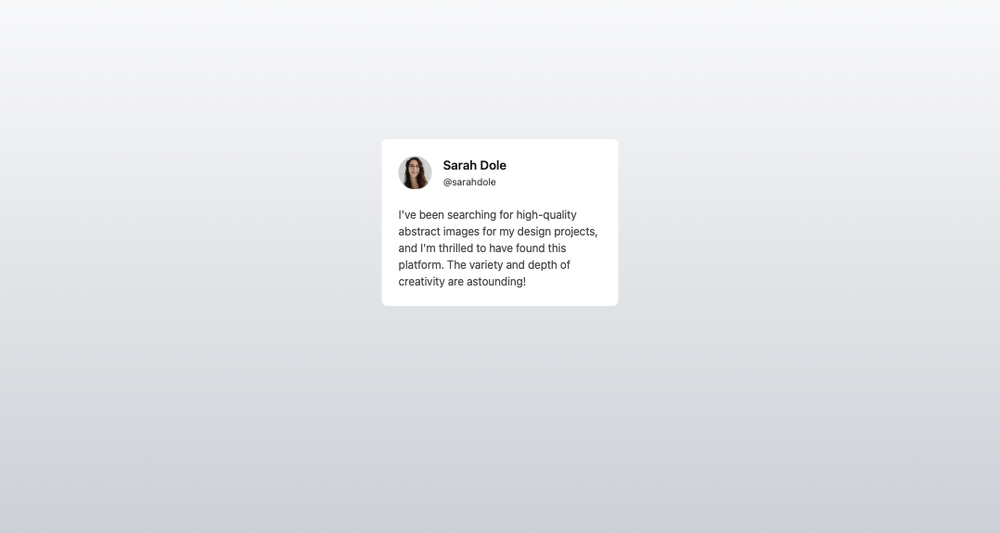
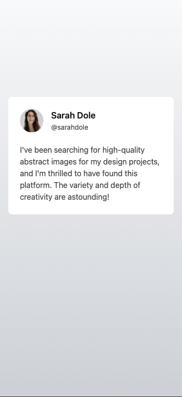

# GreatFrontEnd Projects Challenge

Welcome to the GreatFrontEnd Projects platform!

This is a solution to the [Testimonial Card](https://www.greatfrontend.com/projects/challenges/testimonial-card/completion).

## Table of contents

- [Overview](#overview)
  - [Project brief](#project-brief)
  - [Screenshot](#screenshot)
- [My process](#my-process)
  - [Built with](#built-with)
  - [What I learned](#what-i-learned)
  - [Continued development](#continued-development)
  - [Useful resources](#useful-resources)
- [Author](#author)

## Overview:

Testimonial Card

Build a simple user testimonial card with key testimonial elements

### Project brief

In this challenge, you will develop a card featuring a user testimonial, including a profile image, name, username, and the testimonial body.

## Implementation requirements

- Design fidelity: Aim to follow the design as closely as possible. All elements in the design should be present, using the specified text color, font size, font weight, spacing, dimensions, etc.
- Cross-browser compatibility: Check that your solution works for major browsers including Chrome, Firefox and Safari.
- [Stretch goal] Handle long strings: In reality, the person's name and testimonial can be extremely long. The UI should be able to accommodate extremely long strings by either wrapping to the next line, truncating, or both.
- [Stretch goal] Performance optimization: Optimize image assets and code for quick load times, ensuring a smooth and responsive user experience.
- [Stretch goal] Accessibility and semantics: Follow best practices for web accessibility, such as using semantic HTML and ARIA roles where necessary and using proper alt tags for images.

### Screenshot

## My process

### Built with

- Mobile-first workflow
- [React + Vite](https://reactjs.org/) - JS library
- [Tailwind Css](https://tailwindcss.com/) - For styles
- CSS custom properties
- Flexbox

### Continued development

Making html dom more accessible and making use of best pratices to increase performance. Currently learning to use Lighthouse to check for bestpractices and performance of the webapp.

### Useful resources

- [seo meta description tag](https://developer.chrome.com/docs/lighthouse/seo/meta-description)
- [server images in WEBP, AVIF formats](https://developer.chrome.com/docs/lighthouse/performance/uses-webp-images)
- [Creating AVIF images with Squoosh](https://codelabs.developers.google.com/codelabs/avif#0)
- [Image no loading after deploy in Vite bug fix](https://vitejs.dev/guide/assets.html)
